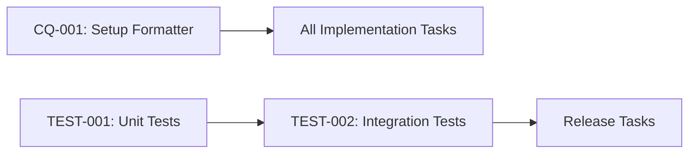

# Tasks: [FEATURE_NAME]

## Implementation Tasks

### Code Quality Tasks
- [ ] **CQ-001**: Set up Spotless formatter with Google Java Style Guide
- [ ] **CQ-002**: Configure IDE formatter files (Eclipse XML, IntelliJ IDEA)
- [ ] **CQ-003**: Review code for SOLID principles compliance
- [ ] **CQ-004**: Add `.editorconfig` to project root

### Testing Tasks
- [ ] **TEST-001**: Write unit tests for [Component] (Target: 90% coverage)
- [ ] **TEST-002**: Set up JUnit 5 and Mockito framework
- [ ] **TEST-003**: Write integration tests using Testcontainers
- [ ] **TEST-004**: Test across Java 8+ versions
- [ ] **TEST-005**: Generate and publish code coverage reports

### API Design Tasks
- [ ] **API-001**: Design public API with backward compatibility in mind
- [ ] **API-002**: Mark internal packages with `internal` suffix
- [ ] **API-003**: Add `@Deprecated` annotations for any deprecations
- [ ] **API-004**: Create migration guide for API changes

### Documentation Tasks
- [ ] **DOC-001**: Write JavaDoc for all public classes and methods
- [ ] **DOC-002**: Add usage examples to JavaDoc
- [ ] **DOC-003**: Update README with quick start guide
- [ ] **DOC-004**: Create code examples that are executable and test-covered

### Performance Tasks
- [ ] **PERF-001**: Create JMH benchmarks for [operations]
- [ ] **PERF-002**: Set up performance regression testing (10% threshold)
- [ ] **PERF-003**: Enable memory allocation tracking
- [ ] **PERF-004**: Review for N+1 patterns and unnecessary object creation

### Resource Management Tasks
- [ ] **RES-001**: Review all I/O operations for try-with-resources usage
- [ ] **RES-002**: Implement AutoCloseable for resources
- [ ] **RES-003**: Review stream operations for bounds and leaks
- [ ] **RES-004**: Audit concurrent access for thread-safety

### Build and CI Tasks
- [ ] **CI-001**: Configure build pipeline with constitution compliance checks
- [ ] **CI-002**: Set up static analysis verification
- [ ] **CI-003**: Configure build failure on MUST-level requirement violations
- [ ] **CI-004**: Set up performance regression test automation

### Release Tasks
- [ ] **REL-001**: Determine version bump (MAJOR.MINOR.PATCH)
- [ ] **REL-002**: Update CHANGELOG.md with constitutional changes
- [ ] **REL-003**: Create release notes highlighting constitutional compliance
- [ ] **REL-004**: Verify all compliance checks pass before release

## Task Dependencies

## Definition of Done
- [ ] All unit tests pass with 90%+ coverage
- [ ] All integration tests pass across Java 8+
- [ ] Performance benchmarks completed and reviewed
- [ ] JavaDoc complete for all public APIs
- [ ] Build pipeline green with compliance checks
- [ ] Documentation reviewed and published
- [ ] Migration guide created (if applicable)
